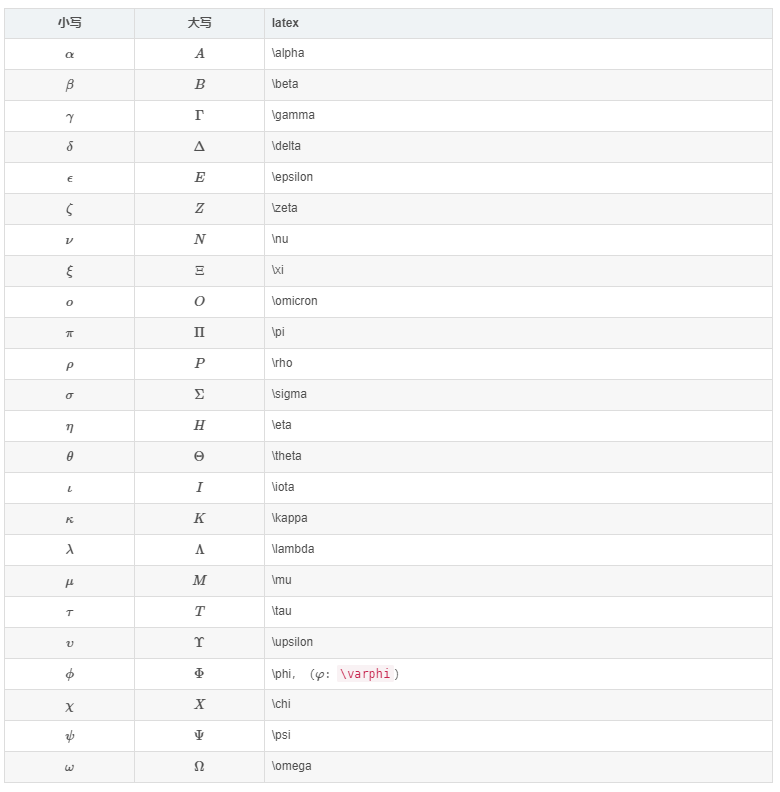

# 在Markdown中使用Latex

说是这么说，其实和直接在Latex中使用Latex语法类似。而且这好像原生Markdown是不支持的，要看具体编辑器是否支持Latex扩展。

## 希腊字母

小写希腊字母首字母小写，大写希腊字母首字母大写。

## 常用数学符号

### 二元关系符号和二元运算符

---

### 大尺寸数学运算符

[更多运算符](http://www.mohu.org/info/symbols/symbols.html)

